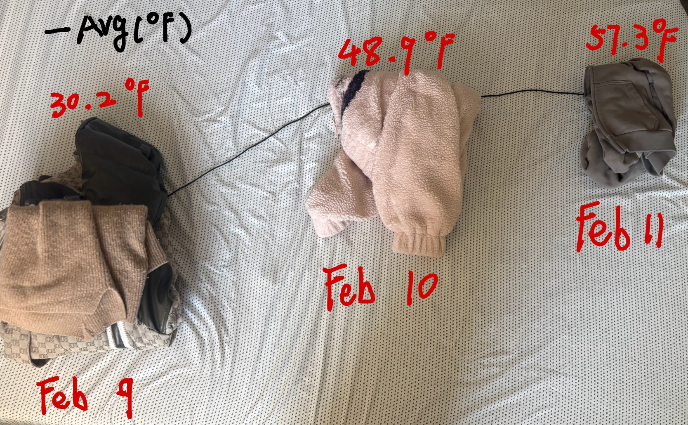

## ***From Climate to Clicks: Tracing My Everyday Digital Life***

### **Introduction**

Most of the data that shapes my life is quiet and habitual: the temperature outside my window, the hours I spend on my phone, and the small payments made through a few taps on a screen. These actions rarely feel connected in the moment, yet over time they form patterns. This project slows that process down and makes those patterns visible.

From February 9th to February 11th, I collected data to explore three related questions:

-   How does the weather frame my daily routines?
    
-   How much time do I spend in digital spaces?
    
-   How much do I spend on online shopping and food delivery?
    

Rather than treating these questions separately, I approached them under one central theme:

> How does my physical environment influence my digital behavior and online consumption?

I began with weather as the external context of each day, then examined screen time as a measure of digital attention, and finally analyzed online spending as a potential outcome of that engagement. Together, the sequence moves from environment, to attention, to consumption.

Instead of using automated charting tools, I translated each dataset into a crafted visualization using different materials and techniques. Through this process, I realized that medium shapes interpretation: some forms made patterns immediately clear, while others required deeper engagement. Ultimately, this project examines not only what the data reveals, but how the act of visualization transforms everyday routines into something structured and meaningful.

### **How Does the Weather Frame My Daily Routine?**

To begin exploring how my daily life is shaped, I first asked how daily weather frames the structure of my routines. Weather serves as the external context within which all other behaviors unfold. Before examining how I allocate my attention or spend money in digital spaces, it was important to understand the physical conditions surrounding each day. Within the broader central theme — how my physical environment influences my digital behavior and online consumption — weather functions as the starting point. It represents the environmental backdrop that may subtly guide whether I spend more time indoors, turn to my phone for entertainment, or engage in online purchasing.

To answer this question, I collected weather data directly from Apple’s built-in Weather application. For February 9th, 10th, and 11th, I recorded daily maximum, minimum, and average temperatures. I accessed this data once per day and documented it manually to ensure consistency. 

Below is a table summarizing the recorded weather data for the four-day period:
| Date       | High (°F) | Low (°F) | Avg (°F)     |
|------------|-----------|----------|------------|
| Feb 9      | 45        | 16       | 30.2     |
| Feb 10     | 70        | 28       | 48.9     |
| Feb 11.    | 64        | 46       | 57.3     |

Rather than representing temperature with a conventional digital line graph, I translated the data into a physical visualization using clothing as material. Clothing acts as a direct bodily response to temperature; what I choose to wear reflects how cold or warm the day feels. In this visualization, each day’s outfit is positioned according to that day’s average temperature. Colder days are placed lower on the surface, while warmer days are positioned higher.

To connect these daily points, I used a charging cable to form a continuous line linking the clothing placements. The cable visually mimics a traditional line graph, tracing the rise and fall of average temperatures across the three days. This approach maintains the structural logic of a line graph while grounding the data in a material representation tied to lived experience. The resulting form makes the fluctuation of temperature physically visible, translating abstract numerical averages into spatial movement.

The visualization of this temperature shift is shown below:

The data shows a clear upward trend across the three days. February 9th was significantly colder, with an average temperature of 30.2°F, followed by a substantial increase on February 10th (48.9°F) and an even warmer February 11th (57.3°F). The temperature difference between the coldest and warmest day spans more than 27 degrees, indicating a meaningful environmental shift over a short period.

This fluctuation suggests that the physical environment was not constant but changing noticeably each day. The colder first day likely encouraged more indoor activity, while the warmer subsequent days may have made outdoor movement more comfortable. When viewed in relation to my central theme, this environmental variation establishes the foundation for examining behavioral changes in the following sections. The weather data provides the contextual baseline against which patterns in screen time and online spending can be interpreted, positioning temperature as a potential upstream factor influencing digital engagement and consumption.

### **How much time do I spend in digital spaces?**
After establishing weather as the environmental context of each day, I turned to a more behavioral measure: my screen time. Within the broader central theme — how my physical environment influences my digital behavior and online consumption — screen time functions as the intermediary variable. It represents how much of my day is spent in digital space and serves as a potential bridge between environmental conditions and financial activity.

I therefore asked:

> How much of each day do I spend actively using my phone, and does that time vary across changing environmental conditions?

To collect this data, I used the Battery section within my iPhone Settings, which provides a detailed breakdown of daily “Screen On” time. This feature automatically records the total duration that the screen is actively in use, making it a reliable and comprehensive source of usage data.

From February 9th through February 11th, I recorded the total screen-on time once per day. Because this information is passively tracked by the device itself, it eliminates recall bias and ensures accuracy. I manually transcribed the daily totals into my dataset to remain engaged in the data collection process.

The recorded values are as follows:
|Date  | Screen Time |
|--|--|
| Feb 9 | 8h 44m |
| Feb 10| 4h 57m |
| Feb 11| 5h 50m |

Rather than representing these values as a traditional bar graph or line chart, I created a clock-based circular visualization using D3. Each day is represented as a full 24-hour circle. The total screen time for that day is mapped as an arc proportional to the full circumference of the circle. In this mapping:

-   24 hours = 360° (the full circle)
    
-   Screen time minutes = proportional arc length
    

For example, 8 hours and 44 minutes on February 9th occupies over one-third of the circular form, visually dominating the day. Shorter usage durations, such as February 10th, produce noticeably smaller arcs.

The circular format was intentionally chosen because time itself is cyclical. By representing a day as a clock-like structure, the visualization emphasizes how screen use occupies a portion of lived time rather than existing as an abstract number. Unlike a bar chart, which compares quantities linearly, the clock format highlights proportion — how much of the total day is consumed by digital engagement.

This design reinforces the conceptual link between time and space: as screen time increases, the digital arc expands, visually taking up more of the day.

The visualization is shown below:

The data reveals a substantial difference between February 9th and the following two days. On February 9th, I spent 8 hours and 44 minutes on my phone — nearly double the amount recorded on February 10th (4 hours and 57 minutes). February 11th shows a moderate increase to 5 hours and 50 minutes, though still significantly lower than the peak on the 9th.

When interpreted in relation to the weather data, the highest screen time corresponds with the coldest day. This suggests that environmental conditions may influence how much time I spend indoors and consequently how much time I engage with digital devices.

Screen time, in this project, functions as the behavioral middle layer between environment and consumption. The expansion and contraction of the circular arcs visually reinforce how digital engagement fluctuates across days. Rather than simply reading a number of hours, the circular visualization makes visible how much of a day is occupied by screen use, positioning digital attention as a finite portion of lived time.

### **How much do I spend on online shopping and food delivery?**
Within my broader exploration of how environment and attention shape digital behavior, I finally turned to financial outcomes. After examining weather as environmental context and screen time as a measure of digital engagement, I asked:

> How much do I spend on online shopping and food delivery, and do these amounts reflect shifts in my digital activity?

Online spending represents a tangible consequence of digital presence. If colder days encourage indoor time and increased screen use, I wondered whether that digital engagement might translate into measurable financial behavior.

To collect this data, I used my Chase credit card transaction history. I chose this method intentionally because I use this specific card exclusively for online shopping and food delivery purchases. Each transaction in the Chase app includes detailed descriptions, timestamps, and exact amounts, which allowed me to isolate and categorize only online shopping and food delivery expenditures.

From February 9th through February 11th, I recorded my total daily spending in these categories. I accessed the Chase mobile app once per day and manually documented the total amount spent for that date. Because each purchase is itemized within the app, I was able to verify the accuracy of the totals before recording them.

Below is a summary of the recorded spending:

|Date  | Online Spending ($) |
|--|--|
| Feb 9 | 70.92 |
|Feb 10|38.34|
|Feb 11|38.02|

Using coins as the medium was a deliberate choice. Unlike digital currency, coins have weight, texture, and physical presence. By stacking real money to represent spending, I made the abstract concept of “online consumption” materially visible. The height difference between stacks immediately communicates variation, but the physical effort of stacking and counting the coins also reinforced the tangible reality of those expenses.

The resulting form mirrors a traditional bar graph: vertical columns arranged side by side by date. However, rather than existing as pixels on a screen, the representation occupies physical space. The tallest stack (February 9th) visibly dominates the composition, emphasizing the disproportionate spending on that day.

The visualization is shown below:

The three-day pattern shows a clear spike on February 9th ($70.92), followed by two nearly identical lower amounts on February 10th ($38.34) and February 11th ($38.02). The first day’s spending is almost double that of the following two days.

When considered alongside the previous datasets, this spike corresponds with the coldest day and the highest recorded screen time. This suggests a possible chain of influence: colder weather may increase indoor time, which increases digital engagement, which in turn increases opportunities for online spending.

While the sample size is small, the consistency of the pattern across the three variables strengthens the central theme of this project: my physical environment may indirectly shape my financial behavior through changes in digital attention.

By physically stacking the coins, the difference between days became visually and materially pronounced, transforming numerical values into spatial contrast. The act of building the bars reinforced the uneven distribution of spending and made the variation more intuitive than simply reading the numbers in an app.

### **Synthesis**
Working with three different media—clothing and cable for weather, a D3 clock for screen time, and stacked coins for online spending—shaped how I understood each dataset.

The most challenging visualization was the screen time clock. I intentionally avoided using another bar or line chart, but creating a circular diagram in D3 was technically difficult because it was a new method for me. Translating minutes into proportional arcs required careful thinking, and the pattern was not immediately visible during construction. However, once completed, the circular form clearly showed how much of each day was consumed by screen use.

The weather visualization felt the most engaging. Physically bringing out the clothes I wore allowed me to reconnect with the lived experience of those days. Positioning the outfits by temperature and linking them with a cable made the temperature shift both visual and experiential. It was not just data—it felt embodied.

The coin stacks for spending made differences the easiest to see. The height contrast immediately revealed that February 9th had significantly higher spending. Physically stacking coins also emphasized the tangible weight of digital transactions.

Across the three visualizations, I noticed that material choice influenced clarity. The coins made comparison straightforward, the clothing made context memorable, and the clock required more analytical interpretation. Together, the sequence—weather, screen time, and spending—clarified the central theme: environmental changes may influence digital behavior, which in turn relates to consumption patterns. Crafting each visualization made these connections more visible than reading numbers alone.

### **Conclusion**
Returning to my central question — how does my physical environment influence my digital behavior and online consumption? — the three-day study suggests a possible chain of influence. The coldest day (February 9th) coincided with the highest screen time and the highest online spending, while warmer days showed reduced digital engagement and lower spending. This pattern supports the idea that environmental conditions may indirectly shape attention and consumption by influencing how much time is spent indoors and in digital spaces.

However, this relationship cannot be interpreted as purely environmental. February 9th was also a day without classes, which likely contributed to increased free time, higher screen usage, and greater opportunity for online spending. This additional variable complicates a straightforward causal explanation. While the data suggests a connection between weather, digital attention, and financial behavior, daily schedule and academic obligations must also be considered as influential factors.

Ultimately, this project reveals not a definitive cause-and-effect relationship, but a layered interaction between environment, routine, and digital life. By making these patterns visible through crafted visualization, I became more aware of how multiple contextual factors—both environmental and structural—shape my everyday behaviors.

